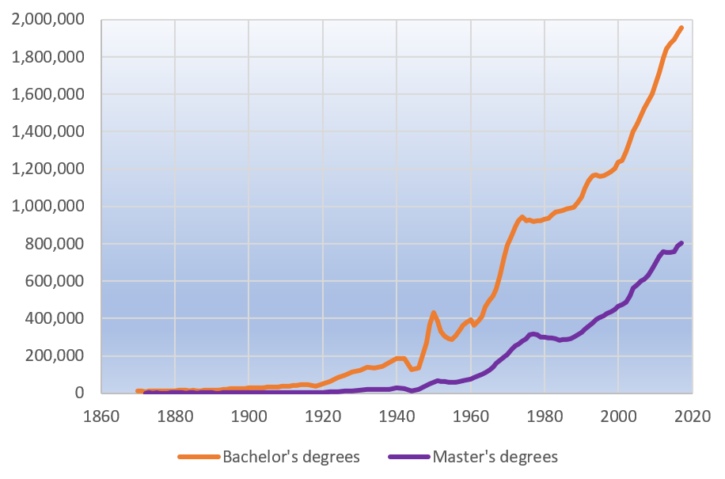

c

I am currently listening to “The Name of The Rose” by Umberto Eco, a historical crime drama about two monks-turned-detectives who investigate a series of murders inside a secluded monastery located somewhere in the eastern alps. One thing that surprised me, was how many languages the characters are purported to have spoken. The adolescent hero, Adso of Melk, can converse in his native German as well as in Latin and is also studying Greek on the side. Even the barbarian Salvatore is able to get around in Italian, Latin and French. This theme already caught my eye in Tolstoy’s War and Peace, where the characters are changing languages ad libitum and most seem to have a grasp of, at least, Russian, French, English and German. I only know a few people who speak more than 2 languages and no one who speaks more than four. In a way, this comparison is unfair because Eco writes about monks, whose job it is to study books and Tolstoy writes about Russian aristocrats whose job it is to make conversation and try not to die in duels. However, I wonder if there is nevertheless something going among the elites.

I.

It was hard to find reliable data on historical figures, especially data that easily lends itself to comparison over time. The best I dug up was Wikipedia’s “List of the Multilingual Presidents of the United States” [1], which reaches back into the 18th century and seems pretty comprehensive. From this, I created the following graph using only the languages in which the men were fluent \*. This is because I think reporting on fragmentary language skills becomes more unreliable as we go back in time.

###### Number of foreign languages spoken by us presidents

The graph shows the year each president took office vs the number of languages they knew besides English.  In the years following the independence, the US was led by several polyglots, who were followed by a line of people who knew two languages (mostly Latin and Ancient Greek) and then, nothing. It is kind of eerie to think that the last American president who spoke a foreign language died in 1945.

II.

In the search for a reason that could explain this dramatic decline, I found this Atlantic article [2] from 1917 which applauds Columbia’s and other colleges recent decision and to drop knowledge of Latin as an admission requirement and encourages other universities to follow suit.

> In the first place, the idea of the cultivated person, man or woman, has distinctly changed during the past thirty-five years. Cultivation a generation ago meant acquaintance with letters and the fine arts, and some knowledge of at least two languages and literatures, and of history. The term ‘cultivation’ is now much more inclusive. It includes elementary knowledge of the sciences, and it ranks high the subjects of history, government, and economics.  
> Secondly, when Herbert Spencer sixty years ago said that science was the subject best worth knowing, the schoolmasters and university professors in England paid no attention whatever to his words. The long years of comparative peace, and of active manufacturing and trading, which the British Empire after that date enjoyed did something to give practical effect in British education to Spencer’s dictum. The present war has demonstrated its truth to thinking men in Europe and America. It now appears that science is the knowledge best worth having, not only for its direct effects in promoting the material welfare of mankind, but also for its power to strengthen the moral purposes of mankind, and make possible a secure civilization founded on justice, the sanctity of contracts, and good-will.  
> […]  
> There was a time when the principal part of the work of universities was training scholarly young men for the service of the Church, the Bar, and the State; and all such young men needed, or were believed to need, an intimate knowledge of Greek and Latin; but now, and for more than a hundred years, universities are called on to train young men for public service in new democracies, for a new medical profession, and for finances, journalism, transportation, manufacturing, the new architecture, the building of vessels and railroads, and the direction of great public works which improve agriculture, conserve the national resources, provide pure water-supplies, and distribute light, heat, and mechanical power.

It is noteworthy that this article was published a month before the United States entered World War I, and was well on its way to become the world’s dominant economic power. To keep the wheels from grinding to a halt, the country needed more skilled laborers and, increasingly, white-color professionals. That could not have been possible without opening the universities to students who were not raised as part of the elite.

This graph, which I took from here [3], demonstrates this impressively.

III.

All in all, while I think this analysis produced some valuable insights, it is lacking in a lot of places. When I started researching, I wanted to focus on the European upper classes, because their lines are longer and  it related to better to the literature figures that inspired this post. This attempt was stopped by my failure to find any kind of useable data and so I had to fall back on using data from the US.  Americans might not be so interested in learning foreign languages, but at least, they keep their Wikipedia articles up to date.

\* I also chose to include Martin Van Buren’s who spoke Dutch, however, he learned it as a first language

Sources

\[1] [https://en.wikipedia.org/wiki/List_of_multilingual_presidents_of_the_United_States](https://en.wikipedia.org/wiki/List_of_multilingual_presidents_of_the_United_States)

\[2] [https://www.theatlantic.com/magazine/archive/1917/03/the-case-against-compulsory-latin/543222/](https://www.theatlantic.com/magazine/archive/1917/03/the-case-against-compulsory-latin/543222/)

\[3] Von Stilfehler - Eigenes Werk, CC BY-SA 4.0, [https://commons.wikimedia.org/w/index.php?curid=84396856](https://commons.wikimedia.org/w/index.php?curid=84396856)