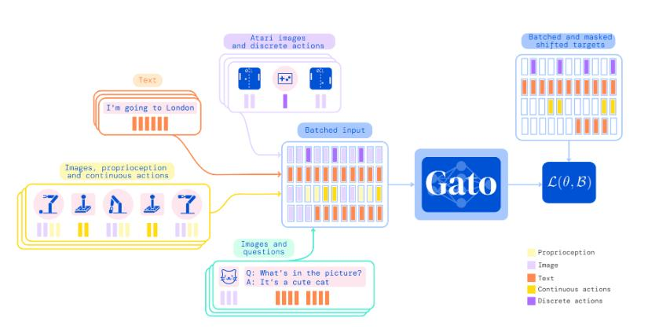

Over the last months, a flood of new papers presenting advanced AI systems have been published. In January, OpenAI released DALL·E 2, a text-to-image model which can generate aesthetically pleasing images with startling accuracy [1].

A couple of weeks later, Google unveiled PaLM, a 540-billion parameter language system capable of verbal reasoning and source code generation [2].

And, just shortly after that, DeepMind released Gato, a generalist model, which is still rough but can execute diverse tasks such as labeling images, replying to texts or playing video games [3].

This has provoked a wave of discussion across the machine learning community. As far as I can gauge, most reactions have been celebratory, seeing these advances as the first steps in devising better and better AI systems that could soon be capable of relieving humans from a wide variety of unpleasant but necessary tasks. Other reactions have been more cautious and a few have been straight-up horrified, painting the image of a future where AI turns against its human creators. These later views have mainly been advanced by a small but determined research community and an active blogosphere, centered around the _Machine Intelligence Research Institute_ _(MIRI)_ and the _Alignment Research Center_. These groups study and aim to create Artificial General Intelligences (AGIs) which are fundamentally aligned with human values and unlikely to turn against the species that designed them. I have never really understood this perspective, as it was unclear to me how exactly an AI system could gain control over humanity. In order to understand this position better, I read _AGI Safety From First Principles_ by Richard Ngo, formerly a researcher on the AGI safety team at DeepMind [4].

**Why would an AGI system outperform humans?**

The core thesis of the paper is that we might develop AGI systems that are smarter than us and pursue goals much different from our own. Ngo worries that if an AGI system outperforms humans at the kind of tasks which enabled us to dominate the world, Homo sapiens itself might be reduced to the status of a “second species” in case of an AGI takeover. For this to happen, however, there must be large incentives to develop a system capable of general reasoning in the first place. We currently mainly work with _narrow AIs,_ designed to perform well at specific tasks such as playing Go [5] or predicting the 3D structure of a protein from a 1D amino acid sequence [6]. However, many tasks (such as managing a large company) require a broad understanding of economic and societal mechanisms while having very little training data available. These tasks are hard for narrow AIs and, therefore, a _general AI_ system would be needed to perform well there. Ngo believes that there are a number of reasons to believe that superhuman performance in general reasoning might be relatively easy to achieve for machine learning (ML) systems. Transistors are around 4 million times faster than neurons, and unlike our brains which are constrained by energy scarcity and weight limitations, neural networks can grow almost arbitrarily large. An AI system might also repeatedly copy itself and collaborate with its replicas as well as ultimately become able to alter and improve its own source code.

**Why might an AGI system not be perfectly aligned?**

AIs can be classified into two categories: agentic and non-agentic. Agentic AGIs would be able to act as an agent and pursue their own goals. Today, most systems such as AlphaGo are non-agentic, as they simply optimize according to a loss function determined by its human creators. However, there is reason to believe that agentic systems have an advantage for complex, long-term tasks and this might lead scientific research to steer in that direction. Such an agentic AGI would be much more unconstrained in its decision-making and more likely to gain motivations different from the ones set by the operator. Ngo specifies two types of misalignment. _Outer misalignment_ means that the task is formulated in such a way that the AGI will misinterpret its instructions even though it does “want” to do so. _Inner alignment_ means that the agent simply over time develops its own goals different from the original ones. This can also happen in humans, where, even though evolution incentivized humans to procreate, many people actively avoid it and instead spend their evenings writing long-winded blog posts on obscure topics which hardly anyone will ever read. Ngo gives an example of an AGI, which is told never to disobey its handlers or be shut down and kills them because this will maximize the chances that it will remain powered on.

**How might an AGI system gain control?**

The previous arguments do not necessarily imply that AGI will take over in the same way that a single human teleported back into the stone age could not easily dominate that society either. However, because an AGI could run simultaneously on different machines and scale itself quickly, it would be much less constrained than a single person. Ngo outlines two scenarios in which an ML system might take control. The first, as described by Paul Christiano in a blog post [7], assumes that the AGI is given more and more control in the economic and political system until shutting it off would demolish human civilization. At that point, it would no longer be incentivized to obey its operators. In another scenario, advanced by Bostrom [8] and Yudkowsky [9], technological breakthrough developments would allow a single agent to dominate. Ngo names nano-, biotechnology, and hacking as possible roads to power but also states that prediction technologies which do not yet exist is extremely difficult. To prevent such a development, knowing the speed at which an AI can go from unnoteworthy to superhuman performance is critical. Recent advances, such as AlphaGo Zero, which can train to beat the best human players in the ancient game of Go in less than 36 hours while starting from scratch make the author pessimistic that we would have a reasonable amount of time to prepare for and intervene in a fast AGI takeoff. Ngo, therefore, proposes making AI systems inherently more transparent and constraining them computationally. Still, from watching our inability to deal with climate change, another looming catastrophe, he is skeptical that humanity will be able to coordinate.

**Own thoughts**

The whole field of AI safety is weird to me because while I see many smart people worry intensively about it and I can follow their arguments logically, my mind simply refuses to take them seriously on an emotional level. This is maybe a good thing because even if wanted to do something about it, I probably lack the necessary intellectual horsepower to get into a position where I could seriously influence the course of AGI development and so this would only add an unnecessary worry to my brain’s already busy overthinking department.

###### [1]  Ramesh, A., Dhariwal, P., Nichol, A., Chu, C., & Chen, M. (2022). Hierarchical text-conditional image generation with CLIP latents. [http://arxiv.org/abs/2204.06125](http://arxiv.org/abs/2204.06125)  
###### [2] Chowdhery, A., Narang, S., Devlin, J., Bosma, M., Mishra, G., Roberts, A., Fiedel, N. (2022). PaLM: Scaling language modeling with Pathways. [http://arxiv.org/abs/2204.02311](http://arxiv.org/abs/2204.02311)  
###### [3] [https://www.deepmind.com/publications/a-generalist-agent](https://www.deepmind.com/publications/a-generalist-agent), Accessed: 14.05.2022  
###### [4] [https://www.alignmentforum.org/s/mzgtmmTKKn5MuCzFJ](https://www.alignmentforum.org/s/mzgtmmTKKn5MuCzFJ), Accessed: 14.05.2022  
###### [5] Silver, D., Huang, A., Maddison, C. _et al._ Mastering the game of Go with deep neural networks and tree search. _Nature_ **529,** 484–489 (2016). [https://doi.org/10.1038/nature16961](https://doi.org/10.1038/nature16961)  
###### [6] Jumper, J., Evans, R., Pritzel, A. _et al._ Highly accurate protein structure prediction with AlphaFold. _Nature_ **596,** 583–589 (2021). https://doi.org/10.1038/s41586-021-03819-2  
###### [7] Paul Christiano. What failure looks like, 2019. URL https://www.alignmentforum.org/posts/HBxe6wdjxK239zajf/what-failure-looks-like.  
###### [8] Nick Bostrom. Superintelligence: Paths, dangers, strategies. 2014.  
###### [9] Eliezer Yudkowsky et al. Artificial intelligence as a positive and negative factor in global risk. Global catastrophic risks, 1(303):184, 2008. URL https://intelligence.org/files/AIPosNegFactor.pdf.