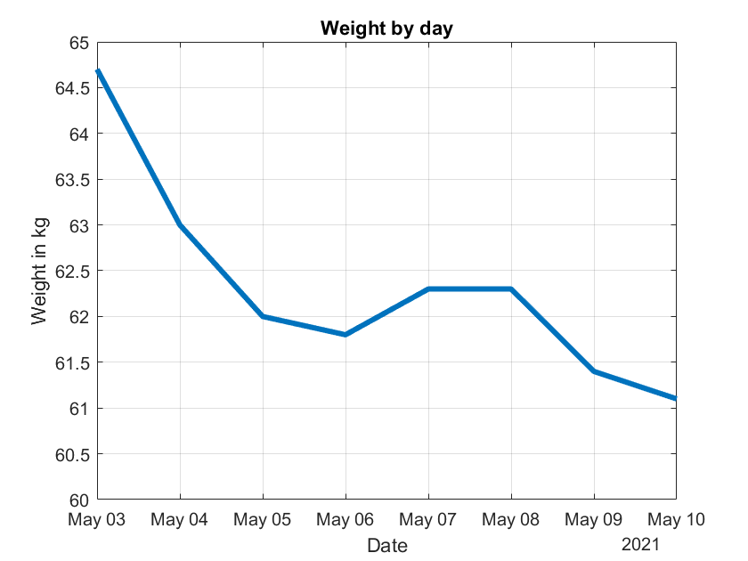
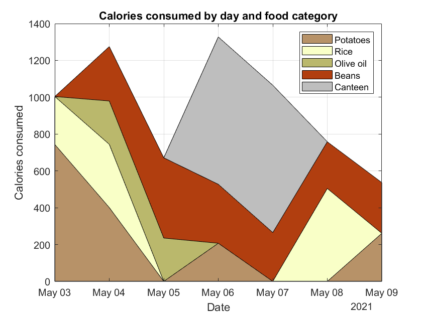

###### _\[I have no special knowledge of nutrition, food or weight loss. This diet is probably very unhealthy and might be straight out dangerous for some people. Please don’t take advice from this article.]_

For more than a year, my country has been in lockdown and, unlike the waistlines, the opportunities to exercise have become slim. According to _The Economist,_ the Germans have even invented the word “Coronaspeck” (corona bacon) that describes the added fat tissue [1]. I am German and have never heard this word anywhere, so either they made it up or I’m just not cool enough to know people who use words like that. Either way, I too have regrettably added some _Coronaspeck_. Not a lot, but enough to make me nervous. While looking into ways to lose some of it, I discovered Stephan Guyenet’s blog _Whole Health Source_ [2].

#### I

Guyenet is a neuroscientist who has specialized in obesity research and has gained some notoriety for his public fights with fellow obesity researcher Gary Taubes. Unlike Taubes, who blames sugar for weight gain and advocates a low-carb diet, Guyenet thinks the type of calorie doesn’t matter so much. According to him, our food has been engineered to be hyper-palatable which makes people massively overeat. In his own words [3]:

_We live in a society where most of the food is at a level of reward/palatability that our species has never encountered before. We’re surrounded by it, and everywhere we turn, someone is jockeying for our attention, trying to get us to purchase their food. We’re used to it– and for the most part, we like it. This professionally engineered food drives our behavior in a way that is only loosely under our conscious control, with a small percentage of the population succumbing to frank addiction._ […]

_Cultures around the world have thrived, and continue to thrive, on very plain food. Our grandparents ate simpler food than us when they were our age, and the food that their grandparents ate was even simpler. There is nothing physically or psychologically necessary about the type of food that most people in affluent nations eat today.  
_

I don’t know enough about biochemistry to know whether his theory is solid, however, it seems like an easy experiment, so I’m going to give it a try.

#### II

Guyenet presents a 5-level plan that aims to reduce food reward by taking away the worst culprits one after another [4]. This sounds too reasonable, so I’m going to start with level 5.

_**Level 5**_

_This level reduces variety, which is another reward factor ([4](http://www.ncbi.nlm.nih.gov/pubmed/21593492)).  This is something that you attempt at your own risk, as there may be downsides to eating the same foods every day.  I think the risk is small if you choose your three foods carefully.  I wouldn’t recommend doing this indefinitely, but rather as a short-term strategy to lose fat, followed by a more relaxed maintenance phase._

_1. Pick three foods, and eat nothing else.  Try to pick foods that will provide a relatively balanced diet.  A starch, a meat and a green vegetable is one possibility.  For example: potatoes, broccoli and beef.  Again, cook everything gently and add no seasonings to your food whatsoever, including salt._

I had planned to eat only cooked, unsalted potatoes for a week, however, that proved simply to be too hard. Potatoes really fill me up and I couldn’t eat enough of them to stop feeling hungry. Therefore, I allowed myself to eat other staple foods too. In the end, I decided on Potatoes, rice, kidney beans and olive oil. Drinking the oil was pretty disgusting even by potato standards, however, none of the first three contains a significant amount of fat and I wanted my diet to be at least somewhat balanced. Still, I think, the diet is pretty unhealthy and I wouldn’t do it long term.

The rules were simple. I was only allowed to eat these four foods, cooked in the cases of rice and potatoes, but raw otherwise. I could eat as much as I wanted, however, I was not allowed to spice or mix them in any way.  I would weigh myself every morning and the food every time before eating and write it all down to monitor my progress. As usual, I took a daily supplement for vegetarians.

#### III

Over the 7 day period, I lost 3.6 kg. My body mass index declined from 22.39 kg/m2 to 21.14 kg/m2. As you can see in the graph, I didn’t lose any weight on March the 6th and the 7th. On these days, I went to work and because I’m not socially awkward enough to just sit there while everyone feasts, I ate at the canteen with my coworkers.

Above you can see how many calories I consumed per day. I guessed 800 kcal for the canteen food, which might be an overestimation. According to my fitbit, I burn around 2000 kcal per day, so I have sustained a substantial calorie deficit during the entire week. It wasn’t that hard because I was allowed to eat as much as I wanted, however, it was very unpleasant. None of the staple foods tasted very well and I longed for something spicy and interesting. My weakness in this regard really surprised me – I don’t think I could have continued the diet for much longer. Nevertheless, in terms of weight loss, the experiment was a success. I lost weight more easily than during my previous experiments and my productivity didn’t suffer.

#### IV

The biggest surprise was how much better I felt when I only had a very small lunch. Normally, I stuff myself with lots of carbs at noon, fall into a slump and not do much for an hour. That slump disappeared and I was able to stay productive pretty much the whole day. I will try to continue eating staple foods for lunch for a while and monitor how it affects my weight and work.

###### [1] https://www.economist.com/1843/2020/04/08/do-you-speak-corona-a-guide-to-covid-19-slang (paywalled)
###### [2] http://wholehealthsource.blogspot.com/
###### [3] http://wholehealthsource.blogspot.com/2011/07/simple-food-thoughts-on-practicality.html
###### [4] http://wholehealthsource.blogspot.com/2011/06/food-reward-dominant-factor-in-obesity_28.html